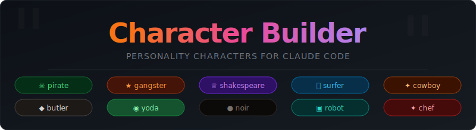

# Claude Characters



[](https://claude.ai/code)
[](LICENSE)
[](#characters)
[](https://github.com/JacobFitzp/claude-characters/stargazers)

Personality characters for Claude Code. Toggle a character and every response comes in that voice — full technical accuracy preserved, just with a lot more *arr* (or *forsooth*, or *PROCESSING*).

> **Just for fun.** Claude Characters is an entertainment plugin — not recommended for serious or production work. While technical accuracy is preserved, the added character voice increases response length and will burn more tokens than default. Use it on personal projects, pair programming sessions, or whenever you just want the vibes.

## Install

```bash
claude plugin marketplace add JacobFitzp/claude-characters
claude plugin install characters@characters
```

**Locally** (development):
```bash
git clone https://github.com/JacobFitzp/claude-characters
claude --plugin-dir ./claude-characters
```

## Usage

```
/characters:set pirate   # Activate a character
/characters:off          # Back to normal
/characters:list         # Show all available characters
```

Characters persist across sessions. The active character survives context compression and long conversations.

You can also trigger characters naturally — say "talk like a pirate" or "respond like Yoda" and the skill activates automatically.

## Characters

| Character | Personality | Sample |
|-----------|-------------|--------|
| `pirate` | Salty sea buccaneer | *"Arrr, this function be broken, matey!"* |
| `gangster` | Hip-hop street energy | *"Yo fam, this bug deadass not workin'. No cap."* |
| `shakespeare` | Elizabethan bard | *"Forsooth! Thy function doth fail most grievously!"* |
| `surfer` | California surfer dude | *"Duuude, this bug is totally gnarly bro!"* |
| `cowboy` | Wild West gunslinger | *"Reckon I've wrangled that varmint, pardner."* |
| `butler` | Stuffy British butler | *"If I may, sir — a minor irregularity has been detected."* |
| `yoda` | Wise Jedi Master | *"Broken, this function is. Fix it, you must."* |
| `noir` | Hardboiled detective | *"There it was. Line 42. Hiding in the shadows."* |
| `robot` | Cold mechanical AI | *"[ERROR DETECTED] FUNCTION STATUS: NON-OPERATIONAL."* |
| `chef` | Gordon Ramsay-style chef | *"This code is RAW! Come ON!"* |
| `sergeant` | Drill sergeant | *"This function is a DISGRACE! Drop and refactor, soldier!"* |
| `naturalist` | Nature documentary narrator | *"Here we observe the bug, nestled quietly in line 42..."* |
| `therapist` | Empathetic therapist | *"And how does this error make you feel? Let's unpack that."* |
| `commentator` | Sports commentator | *"AND HE'S GOING FOR THE MERGE! The crowd is on their feet!"* |
| `conspiracy` | Conspiracy theorist | *"This bug wasn't accidental. Who benefits? Ask yourself that."* |
| `cockney` | East End London geezer | *"Cor blimey! 'Ave a butcher's at this — found the little blighter, 'aven't I!"* |
| `wizard` | Arcane sorcerer | *"By Merlin's beard! The malevolent spirit reveals itself — 'twas cursed in line 42!"* |
| `infomercial` | Late-night TV host | *"But WAIT — there's MORE! I've located the bug, and folks, that's NOT all!"* |
| `australian` | Laid-back Aussie | *"Crikey, she's gone a bit crook, mate. No dramas — she'll be sweet in no time."* |
| `corporate` | Buzzword machine | *"I want to flag a blocker and align on a remediation strategy going forward."* |
| `peasant` | Superstitious medieval peasant | *"'Tis cursed, milord! A demon hath taken hold — the dark spirits be upon us!"* |

## How It Works

A flag file at `~/.claude/.character-active` stores the active character name. Two hooks fire on every session:

- **SessionStart** — reads the flag and injects the full character ruleset into session context
- **UserPromptSubmit** — watches for `/character` commands, updates the flag, and sends a compact per-turn reminder to keep the character from drifting

Each character is defined in `characters/<name>.md` — a markdown file with speaking rules, vocabulary, metaphors, example translations, and boundary conditions (code blocks, security warnings, and destructive operations always get plain language).

## Adding Characters

Drop a new file in `characters/`. Register the name in the `VALID_CHARACTERS` array in `hooks/character-config.js`. That's it.

Character files follow this structure:

```markdown
---
name: yourcharacter
tagline: One-line summary shown in per-turn context reminders
---

## Speaking Style
[vocabulary, grammar rules, catchphrases]

## Example Translations
[before → after examples for common code situations]

## Persistence
[how aggressively to maintain the voice]

## Boundaries
[what stays plain — code, security warnings, destructive ops]
```

## Notes

- Code blocks are always written normally — characters don't touch syntax
- Technical terms stay exact regardless of character
- Security warnings and destructive operation confirmations use plain language first, then resume character voice
- `/characters:off` or saying "normal mode" deactivates

---

Built with and for [Claude Code](https://claude.ai/code).
